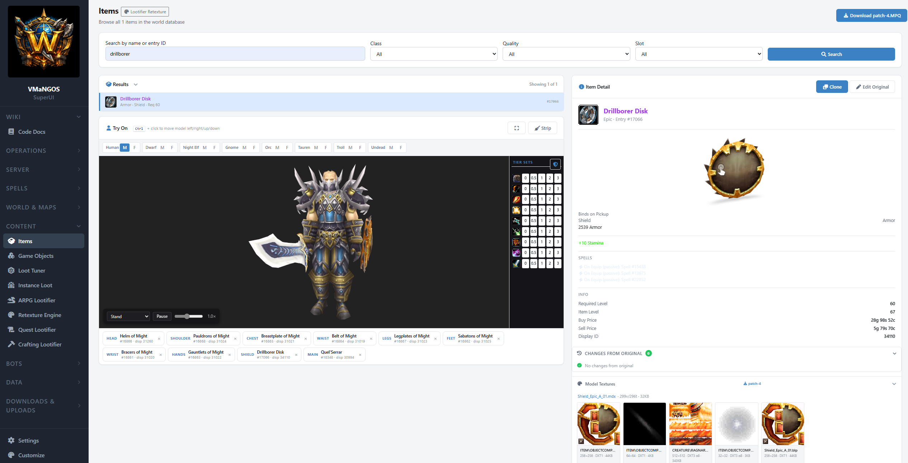
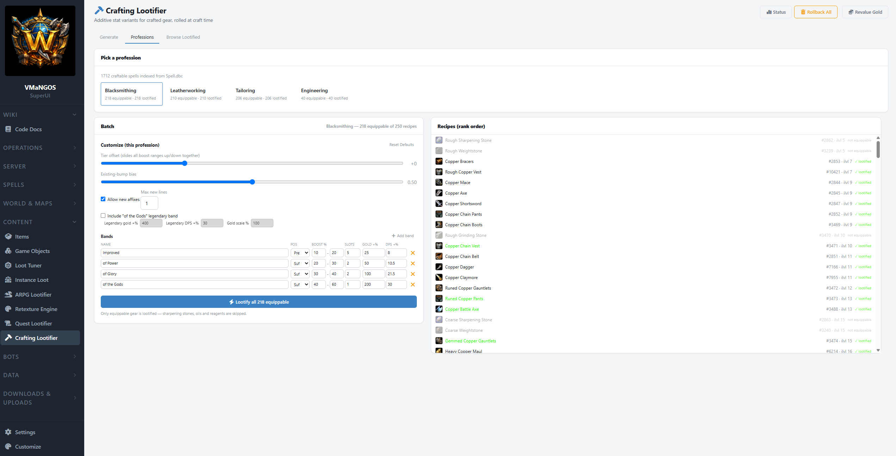
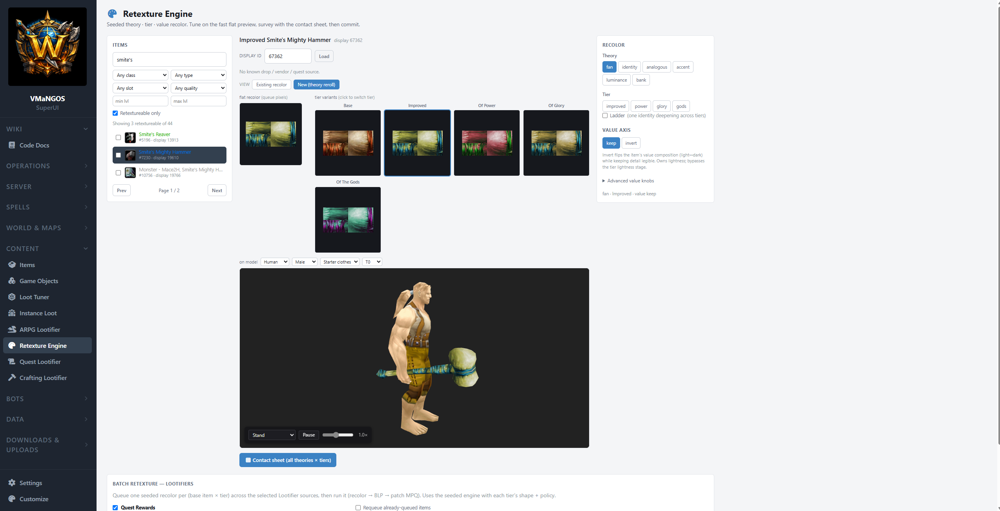

# MangosSuperUI

[https://discord.gg/AzCdnyPHPY](https://discord.gg/3u3tnMnweE) - Community Discord for updates, questions, bugs, etc.

https://www.youtube.com/@Yafrovon — Video walkthroughs and feature demos

MangosSuperUI is an integrated development platform for building a deeply modified Vanilla WoW experience around a [VMaNGOS](https://github.com/vmangos/core) fork (SuperUi-Core).

It combines a browser-based operations and content-authoring platform, a companion VMaNGOS fork, an autonomous playerbot simulation, custom loot and spell pipelines, world-editing tools, and an engineering knowledge base.

I am not designing these as isolated utilities. They are instead designed as one system: SuperUI allows you to modify and tweak the gameplay feel from a UI and operates the world, while SuperUI-Core executes the server-side mechanics and bots (the VMaNGOS fork).

It is the tooling and runtime stack I'm building for the particular version of Vanilla I want to build and play. It can absolutely still be used with stock VMaNGOS - but many of the features (the SuperUI bots, lootifiers, and other future changes) simply won't work as there is no mechanism within stock VMaNGOS for those actions to happen.


<!-- Nico: leaving "Why This Exists" untouched per your note that you're rewriting it. -->

## Why This Exists

I run a 1.12 VMaNGOS emulation server at home — not public, just for me. 

We all have our own idea of what vanilla could have been, or what we wanted it to be. To make that happen for myself, I needed a way to modify and tune the gameworld in large, batched jobs, so that I could achieve that vision, and replay later with potentially a slightly new take.

My end goal is a living game world with thousands of AI-driven bots that feel real enough, custom spells, items, gameplay loop additions that feel vanilla but add flavor, and the tooling to iterate on all of it rapidly and repeatedly from a single coherent tool that works via intuitive user interfaces instead of retooling myself mentally for each separate subsystem.

I'm open-sourcing it because if I wanted this, other people running VMaNGOS — or those who want to explore 1.12 vanilla emulation — probably could too. It's first and foremost a tool I'm building towards my vision and is not a commercial product. Feedback, bug reports, and contributions are welcome.

> **⚠️ Work in Progress:** MangosSuperUI is functional and actively used, but it is not finished. Nothing in it is "done" — see the status board below for where each piece actually stands. Some planned sections (vendors, creatures, quests) are not yet built.


## Disclaimer

This project is not affiliated with or endorsed by Blizzard Entertainment.
World of Warcraft® is a registered trademark of Blizzard Entertainment, Inc.
MangosSuperUI does not distribute any Blizzard assets — icons, 3D models, and minimap tiles are read on demand from your own WoW 1.12.1 client's MPQ archives (set the Client Data Path in Settings). No extraction step is required.
MangosSuperUI is a tooling and interoperability framework intended for educational, research, archival, and private emulator development purposes.

---

## Features

The project is two code bases working as one: the **web platform** (this repo) and **SuperUI-Core**, the VMaNGOS C++ fork it drives. Below is everything currently in the project, and roughly how finished each piece is — rated against *my own* vision for it, not against "does it technically work."

**Status scale** — `0` not started · `3` early / partial · `5` works, with real gaps · `7` solid, in daily use · `9` near-complete · `10` does everything I envisioned, perfectly (nothing here has earned a 10 yet).

| Area                         | What it is                                                                                                                                         | Status   |
| ---------------------------- | -------------------------------------------------------------------------------------------------------------------------------------------------- | -------- |
| SuperUI-Core                 | The forked C++ engine: bot fleet, in-core loot generation, rotation system, the bridge                                                             | **5/10** |
| Server Operations            | Dashboard, console, players/accounts, config editor, audit log, live logs, backup/restore                                                          | **8/10** |
| Content Editing              | Items, spells, game objects, loot tuner, per-boss instance loot                                                                                    | **4/10** |
| Lootifiers                   | Additive stat/dps/named-variant generators — ARPG (openworld/dungeons), Quest, Crafting                                                            | **7/10** |
| Retexture Engine             | Tier-based item recoloring with 3D preview, theories, value inversion                                                                              | **4/10** |
| World Map                    | Leaflet minimap viewer + click-to-place object spawning                                                                                            | **5/10** |
| 3D World Editor              | In-browser terrain sculpting + WMO placement injected back into the game world                                                                     | **4/10** |
| Spell Creator                | Concept-to-playable custom spells with AI visuals and client patching                                                                              | **4/10** |
| AI Playerbots — Barrens Chat | Autonomous questing/combat/economy bots with LLM chat and personas                                                                                 | **4/10** |
| Data & Development           | Database Explorer, Source Map, OG Baseline, Wiki reader, Downloads, Settings                                                                       | **6/10** |
| Wiki                         | Wiki for the entire VMaNGOS fork source code (~1200 docs), future is SuperUI this project full docs, as well as gameplay wiki (quests/tactics/tbd) | **3/10** |
| Profession Tuning            | Batch recipe tuning (mat costs, later adding items to professions)                                                                                 | **2/10** |
| Managed MPQ / BLP layer      | Bespoke C# MPQ+BLP pipeline replacing native StormLib / War3Net                                                                                    | **7/10** |

---

### SuperUI-Core — the VMaNGOS fork

**Status: 5/10**

A fork of VMaNGOS that carries everything the web platform can't do from the outside. This is the C++ half of the project and it's what the server actually runs.

- **The bot fleet** — a `SuperUiBots/` module tree (`AiBotAI`, `GroupCoordinator`, and combat / grind / loot / movement / teamplay units) forked from VMaNGOS's `BattleBotAI` into a fully autonomous open-world bot.
- **The bridge** — a bidirectional TCP link (port 3444) so the C# behavioral engine can drive the C++ bots in real time.
- **In-core loot generation** — award-time hooks that swap vanilla rewards for rolled variants without touching drop tables: `QuestRewardVariantStore` (`RewardQuest`), `CraftingRewardVariantStore` (`Spell::DoCreateItem`), each with boot-load, reload commands, and chat-command registration.
- **Combat rotation slate** — a priority-sorted, first-match-wins rotation system loaded into a bot at runtime over the bridge, with the original VMaNGOS AI as the fallback branch (no core patching required to run vanilla behavior).

The fork is functional and stable. Everything is additive. Your base unmodified vanilla VMaNGOS is there, and everything additional is something you opt to use via the SuperUI (SuperUI permanent bots, crafting lootifier, quest lootifier, and other future additions).

### Server Operations

**Status: 8/10**

**Dashboard** — At-a-glance server health with a built-in **Diagnose** button that probes every subsystem and tells you specifically *why* something is broken. Process status for mangosd and realmd (with auto-detection of process names via `/proc` scanning), RA connection status, all five database connections, players online, uptime, core revision. First-run detection shows a setup banner when configuration is missing.

**Console** — Full RA terminal in the browser via SignalR. Send any GM command, see responses in real time. Command history and autocomplete.

**Players & Accounts** — Search, inspect, and manage characters and accounts. Kick, mute, ban, teleport, send mail/items, adjust GM levels. Everything audit-logged.

**Config Editor** — All 601 `mangosd.conf` settings organized into 22 human-readable tabs with descriptions and inline editing. Built from a curated metadata mapping — no more hunting through a 2,000-line conf file.

**Activity Log** — Append-only audit trail. Every action recorded with operator, IP, full before/after state snapshots, RA commands, and timestamps. Filter by category, action, or target.

**Live Logs** — Real-time log tailing via SignalR. Streams new log lines to the browser every 500ms.

**Backup & Restore** — Three backup groups (Game World databases, Characters, Core Source). Timestamped snapshots with `mysqldump`, one-click restore, auto-safety snapshots before destructive operations. Labels, stats, audit-logged.

### Content Editing

**Status: 4/10**

**Items** — Browse 25,000+ items. Search, filter, paginate. Full detail panel with stats, spells, and loot sources. 3D model viewer for weapons/shields/objects. Clone base game items to create custom variants. Icon picker with DBC-resolved names.

**Spells** — Browse, search, and batch-edit the spell_template table. Grouped search across spell families. DBC-resolved icons, duration, cast time, and range.

**Game Objects** — Browse, search, clone, edit, delete. 3D model viewer. Custom summary field. Integration with World Map for visual placement.

**Loot Tuner** — Bulk loot rate adjustment by quality, level, rank, or instance. Baseline diffs and one-click reset to original values.

**Instance Loot** — Per-boss loot editing for all 26 instances (~256 curated bosses). Full loot tree with reference chain expansion. Edit drop rates, add/remove items.

> The **Vendors**, **Creatures**, and **Quests** editors are still on the roadmap — see Planned



### Lootifiers

**Status: 7/10**

A family of additive stat-variant generators that turn vanilla items into ARPG-style loot without breaking the base game. Each shares the same tier/band engine and commits with full rollback.

- **ARPG Lootifier** — Diablo-style item variant generator. Tier-quota system (Improved, of Power, of Glory, of the Gods), stat family detection, spell-effect items, quality promotion to Epic/Legendary, boss-named legendaries at 150% budget. Batch mode across entire dungeons/raids with full rollback.
- **Quest Lootifier** — swaps quest rewards for rolled variants at award time (via the in-core `QuestRewardVariantStore` hook), with a player-item reroll pass on regeneration.
- **Crafting Lootifier** — swaps crafted outputs for rolled variants at craft time (in-core `Spell::DoCreateItem` hook). Enumerates gear-producing recipes straight from `SkillLineAbility.dbc` / `Spell.dbc` and lets you batch-tune per profession.
- **Additive-only, band-based tiers** — generation is purely additive on top of base stats, bucketed by named tier bands with quality/color floor rules and naming conventions, plus an additive drop-pool mode for open-world mobs.



### Retexture Engine

**Status: 4/10**

A dedicated section for recoloring items into full tier sets — its own controller, JS, and 3D-preview UI, separate from the Lootifier. Recolors are computed in C# (palette-swap engine with smooth chroma-map recoloring) and delivered as a client patch MPQ.

- **Tier colourways** — each tier gets its own coherent palette; progressive swap budget grows by tier (subtle on the low tiers, full colourway swaps at the top).
- **Value inversion** — a global value axis (histogram flip + dark-desat) exposed as UI knobs, on top of the per-family hue work.
- **Set-coherent recoloring** — real item sets *and* ad-hoc multi-select groups share one colourway per tier, so pieces that "look like a set" recolor together.
- **3D preview** — the character viewer is the centrepiece: dress a mannequin in class + tier gear, drop the selected item on top, and see the recolor on the actual model. Skin-slot targeting reads what the geometry actually samples (fixed for tricky weapons like Gressil and Corrupted Ashbringer).
- **Rich item browse** — filter by class, weapon type, armor slot, quality, and level range; navigate by base item name; see which creatures / vendors / quests an item comes from.

Currently its only doing recolors / palette swaps. It's all CPU, and you have different mathematical/logical loops for the existing 7 "theories". While the items page has a pathway that goes to ComfyUI for actual retexturing - at the moment this is too random and uncontrolled. The end goal is to be able to generate coherent retextures that fit the gameworld look.

You can choose to apply a palette change to lootified items in their various tiers (green/blue/epic/legendary) across the current three major lootifier avenues: Crafting, Questing, and Dungeon/Raid/Openworld. 



### World Map

**Status: 5/10**

Leaflet.js minimap viewer for all continents, dungeons, and raids. Click-to-place game objects with automatic terrain Z resolution from VMaNGOS `.map` files. Spawn overlay, compass widget, orientation control.

### 3D World Editor

**Status: 4/10**

A browser-based Three.js terrain renderer reading directly from WoW 1.12.1 MPQ archives — V9 heightmap geometry, server-side composite textures, M2 doodad models with InstancedMesh batching, WMO building rendering, spatial streaming, PBR golden-hour lighting, and a walk mode (WASD + FPS look). On top of the viewer sits a real editor: terrain sculpting with correct MCVT delta patching, WMO placement with full ADT MODF patching, and a server-data regeneration pipeline (vmap/mmap per-tile rebuild).

> **In Progress:** The commit-to-game-world pipeline (DBC patching + patch MPQ generation) is built and functional — place buildings, download the MPQ, restart the world + delete your WDB, and boot the client to see them. Client-side rendering of custom displayIds, cave/interior WMO geometry, and a few terrain "fall-through-floor" cases are still being worked.


### Spell Creator

**Status: 4/10**

A complete custom spell creation pipeline from concept to playable in-game. Create spells with unique visuals, register them at trainers, and generate client patches — all from the browser.

- **Guided Wizard** — 6-step creation flow: search source spell → identity → power presets → appearance (color, intensity, per-phase fine-tune, icon) → ranks & training → review & create
- **Workshop** — per-phase particle controls with independent color, texture, and emission settings
- **Experiment Lab** — SpellDNA extreme parameter testing for discovering visual effects
- **Visual Lab** — Three.js particle renderer with spatial caster/target markers, missile travel, sequence playback, and terrain presets
- **AI-powered visuals** — ComfyUI/FLUX icon generation, AI texture generation (7 themes × 6 roles), Ollama prompt crafting
- **Rank chain system** — auto-generates full rank progressions (e.g. 12 Fireball ranks) with proportional damage/mana scaling
- **Trainer registration** — copy-from-source or add-to-all-class-trainers with SPELL_EFFECT_LEARN_SPELL wrapper generation
- **Unified patch** — a single patch MPQ for all custom spells including DBC entries, icons, textures, and M2 particles


While trainer registration, icons, and visual changes all work - it is still a farcry from being a tool that allows you to add a coherent spell family, or make true novel spell effects. Can you turn frostbolt pink and change the particle speeds/density/emit patterns and make it arcane? Sure. Can you create a spell from scratch without choosing a base spell and easily understand what each spell phase does? No. It's a good start, but it needs a lot more.

### AI Playerbots — Barrens Chat

**Status: 4/10**

This is probably the largest subsystem of the SuperUI project. A fleet of autonomous bots (the "Barrens Chat" server) that quest, fight, travel, trade, and talk — built to feel like real enough players you can group with, dungeon with, AND raid with. The low-latency half lives in the C++ **SuperUI-Core** fork; the high-level decisions live in C#.

- **Bot Tuner Dashboard** — roster, personality bars, decision weights, real economy display, inventory with icons, activity timeline.
- **Behavioral Engine** — domain-based decision system: Questing (full quest graph with sub-phase sequencer), Economy (vendoring, training, repair), Combat (grinding, corpse run), Social (LLM chat via Ollama). Uses *real* character_inventory, real gold, real spell progression — no shadow state.
- **Grouping & escort** — multi-class groups with a virtual god-bot coordinator, player-party escort doctrine, and in-chat commands (`{bot} follow me/auto`) — verified in play following real players into dungeons.
- **Combat rotations** — per-bot rotation profiles authored in C#, pushed to a bot at runtime and evaluated on a 250 ms in-combat sub-tick, with vanilla class AI as the fallback.
- **Chat & social** — LLM personas ("the fictional human behind the bot"), a voice library, tiered chat memory, urge-scored arbitration, and a typing scheduler, tuned for era-authentic 2005-style banter. Health tooling (library + chat diagnostics, rebuild/reassign) keeps it all editable from the UI with no SQL.

Working, but still a far way from done. They level, they quest, and you can invite them to party. However, in real player parties at the moment they follow you more like henchmen in Guild Wars. 

### Data & Development

**Status: 6/10**

**Database Explorer** — Universal browser for all tables across the VMaNGOS databases. This isn't phpMyAdmin — it treats the schema as a connected graph.

- 749 curated relationship edges (discovered via brute-force column overlap testing, because the schema declares no foreign keys)
- Inline editing with audit-logged before/after state
- Relationship panel with expand-to-see-rows navigation
- Interactive SVG ER diagrams with radial layout


**Source Map** — C++ source tree explorer for VMaNGOS/SuperUI-Core development. 4-layer indexing (files, symbols, types, enums), interactive call graph visualization, inline source preview, Topic Explorer and Deep Dive context bundles. Built for understanding the core internals without an IDE.

**OG Baseline System** — Pristine snapshots of your mangos tables before editing. Field-level diffs on every content page. One-click reset at any granularity.

**Downloads** — Host addon ZIPs for players. Auto-generates `Catalog.lua` for the MangosSuperUI_Placer WoW addon.

**Settings** — Full path and credential configuration through the web UI. DBC file status, ComfyUI node pool monitoring, Ollama connectivity. Configuration override system (`server-config.json` over `appsettings.json`).

### Wiki

**Status: 3/10**

The wiki is intended to be the knowledge base for every part of the system. Currently, there is only the SuperUI-Core generated documentation. The future will have the docs for the SuperUI project itself (this), as well as gameplay wiki's (quests/tactics/tbd).

How were these documents generated and how are they usable and not ai slop?

The model I used for these docs is qwen 3.6-27B

The wiki is generated, but it isn't a model's summary of the code. Every structural fact in it — which unit calls what, which functions touch which tables, what line a symbol lives on — comes from a deterministic clang/AST pass over the C++ tree, not from a model reading files and reporting what it thinks it saw. That graph is then pinned against files taken from the running server: the real `mangosd.conf` key set, the live database schemas, and the empirically validated foreign-key map (the same relationship graph behind the Database Explorer, mined by consensus and verified with actual orphan-rate joins). 

Only after all of that is assembled does the local model get involved, and it gets one job: write the prose explaining facts that were already proven. It never produces the map. 

Every page is then checked before it's accepted. Mechanical verifiers confirm that each mined member actually appears in the narrative, that documented boundaries are grounded in real code spans, and that nothing was invented: a config key that isn't in the mined key set, or a table that isn't in the real schema, fails the page and sends it back for another pass. Degenerate output retries automatically. 

The documents provide a very useful way to modify and add functionality to the core, as all of the empirical calls/callees & other data allows a frontier model to 99% pinpoint exactly which source files we need to make a given modification.

### Profession Tuning

**Status: 2/10**

A new tool (just kicked off) for batch-tuning professions, modeled on the Crafting Lootifier's Professions tab but *without* lootifying. The first feature — reduce materials required per recipe by a %, batched across a whole profession with per-recipe opt-out — is in progress. The larger goal is adding items into professions (trainers, drops, etc.), which hasn't started.

### Under the Hood — Managed MPQ / BLP

**Status: 7/10**

A bespoke, fully managed C# MPQ v1 reader + writer and BLP decoder, written to drop the native StormLib P/Invoke and the War3Net library entirely — no native `.so` to build or ship. WoW 1.12 only uses MPQ format v1, which keeps the scope tight. The write path is proven in-client; the reader cutover and BLP decoder are in final on-box validation. Once done, the whole asset pipeline is native-dependency-free.

---

## Architecture

Every page follows the same pattern:

```
Controller (C#)          →  View (Razor .cshtml)      →  JS file (jQuery)
Routes, DB queries,         Thin HTML shell,              All dynamic rendering,
RA commands, audit          scoped CSS                    AJAX calls, DOM updates
```

Key services:

| Service                                  | Role                                                                                            |
| ---------------------------------------- | ----------------------------------------------------------------------------------------------- |
| **RaService**                            | Singleton persistent TCP to mangosd RA. App-level keepalive, prompt-based read, auto-reconnect. |
| **AuditService**                         | Append-only audit trail with before/after state snapshots.                                      |
| **ProcessManagerService**                | Process detection via `/proc` scanning with 3-strategy fallback. Systemd start/stop/restart.    |
| **DbcService**                           | Parses 1.12.1 DBC binary files at startup for icon/spell/item metadata.                         |
| **HeightMapService**                     | Reads VMaNGOS `.map` binary files for terrain Z resolution.                                     |
| **BotBridgeService**                     | TCP bridge (port 3444) between the C++ SuperUI-Core bots and the C# behavioral engine.          |
| **BotBrainService**                      | Decision loop orchestrator, domain routing, Ollama LLM dispatch.                                |
| **RotationService**                      | Loads per-bot combat rotation profiles and pushes them to the fork over the bridge.             |
| **PatchBuilderService**                  | DBC/M2/MPQ pipeline for Spell Creator unified patch generation.                                 |
| **PaletteSwapService**                   | C# recoloring engine behind the Lootifiers and Retexture Engine.                                |
| **SpellTextureService**                  | AI texture generation via ComfyUI/FLUX with BLP conversion.                                     |
| **SourceIndexerService**                 | C++ source tree indexer for Source Map (files, symbols, types, enums).                          |
| **ComfyUIDispatcher**                    | Multi-node ComfyUI pool with channel-based token allocation.                                    |
| **MpqReaderService / MpqBuilderService** | Read/write MPQ archives via the managed C# MPQ layer (StormLib-free).                           |

Database access uses Dapper for VMaNGOS tables (raw SQL, read-heavy) and auto-created tables in `vmangos_admin` for MangosSuperUI's own state. All SQL identifiers validated against schema whitelists.

---

## Requirements

- A working **VMaNGOS 1.12.1** server (compiled, databases populated, able to log in and play) — SuperUI-Core if you want the bots and in-core loot generation
- **Ubuntu 22.04+** or similar Linux (tested on Ubuntu 24.04 LTS)
- **ASP.NET Core 8.0 Runtime** (or SDK if building from source)
- **MariaDB 10.x+** or MySQL 5.5+
- **WoW 1.12.1 client** 

Optional for advanced features:

- **Ollama** with a model like `qwen3:4b` (for Spell Creator prompts + AiBot chat)
- **ComfyUI** with FLUX (for AI icon/texture generation)
- **Python 3 + mpyq** (for M2/BLP extraction on the server)

---

## Installation

See **[INSTALL.md](INSTALL.md)** for the full step-by-step guide covering:

- **Part 1:** VMaNGOS prerequisites — RA configuration (including the critical `Ra.MinLevel` gotcha), systemd services, account setup, sudo permissions
- **Part 2:** MangosSuperUI deployment — .NET runtime, download/build, systemd service, setup script, dashboard verification with Diagnose button
- **Part 3:** Asset extraction — icons, 3D models, and minimap tiles from your WoW client
- **Part 4:** SpellCreator & WorldViewer assets — M2/BLP extraction via python mpyq
- **Part 5:** Validation script — comprehensive audit of your entire installation

The setup script auto-discovers your VMaNGOS paths, database connections, and configuration from `mangosd.conf`. The Dashboard's Diagnose button actively tests every subsystem and tells you specifically what needs fixing.

---

## Roadmap

### Built and Working

Everything in the status board above at 3/10 or higher. Server management, content editors, world map, 3D world editor with WMO placement/injection, spell creator with AI visuals, AI playerbots with LLM chat and combat rotations, database explorer with ER diagrams, source map, backup system, full audit trail — plus the SuperUI-Core fork underneath it all.

### In Progress

- **Retexture Engine settling** — functional but still simple and lack of fine-tune control on outcome.
- **WorldViewer client rendering** — WMO placements commit to the game database but maps regeneration seems shaky.
- **Bot progression 1-60** — bots level, but die too much and need dynamic grouping
- **Bot chat depth** — later chat phases, and reducing open-world grind/travel drift
- **Profession Tuning** — first pass (per-recipe material-cost reduction)

### Planned

- **Vendors & Creatures** — NPC browsing, vendor inventory editing, trainer spell lists

- **Quests** — quest template editor

- **Game Tuning** — XP/honor/reputation rate sliders

- **Adding items to professions** — the larger Profession Tuning goal

- **Docker Compose** packaging for one-command deployment

- **Sound integration** for Spell Creator via SoundEntries.dbc

### Development Philosophy

If any single feature hits a wall beyond ~50 hours, I skip it and move on. Steady forward momentum across the whole platform rather than getting stuck on one piece.

---

## Tech Stack

| Layer            | Technology                                                                                                 |
| ---------------- | ---------------------------------------------------------------------------------------------------------- |
| Backend          | ASP.NET Core 8.0 MVC (C#)                                                                                  |
| Server core      | VMaNGOS fork (**SuperUI-Core**, C++)                                                                       |
| Frontend         | jQuery, vanilla JS                                                                                         |
| 3D Rendering     | Three.js — r128 (World Viewer, Visual Lab) and an r162 ES-module build (World Editor)                      |
| Real-time        | SignalR (Console, Live Logs, Bot Bridge)                                                                   |
| Bot bridge       | Bidirectional TCP (port 3444) between C# and the C++ fork                                                  |
| Database         | MariaDB/MySQL via Dapper                                                                                   |
| 3D Models        | Google `<model-viewer>` (GLB), Three.js (terrain/WMO/M2)                                                   |
| World Map        | Leaflet.js with custom tile layers                                                                         |
| AI Inference     | Ollama (LLM chat/prompts), ComfyUI/FLUX (icons/textures)                                                   |
| MPQ / BLP / DBC  | Managed C# MPQ v1 reader/writer + BLP decoder (replacing native StormLib / War3Net), custom binary parsers |
| Game Assets      | Decoded on demand from the client MPQs (icons, M2/WMO → GLB models, minimap tiles) — no extraction step    |

---

## Project Structure

```
MangosSuperUI/                # the web platform (this repo)
├── Controllers/              # ~25+ controllers — one per page + API endpoints
├── Services/                 # RA, Audit, DBC, Patch, Texture, Bot, Rotation, MPQ, etc.
│   └── Mpq/                  # managed C# MPQ v1 reader/writer + BLP decoder
├── BotLogic/                 # AI playerbot behavioral engine (domains, tracking, data loaders)
│   └── Chat/                 # persona/voice-library chat stack + health tooling
├── Models/                   # ConnectionFactory, POCOs
├── Hubs/                     # SignalR hubs (Console, Live Logs, Bot Bridge)
├── Views/                    # Razor views — thin HTML shells
├── wwwroot/
│   ├── js/                   # One JS file per page — all dynamic rendering lives here
│   ├── css/                  # Global theme, baseline styles
│   ├── data/                 # Curated JSON (commands, config metadata, relationships, etc.)
│   ├── lib/                  # Vendored libs (Leaflet, model-viewer, Three.js)
│   ├── addons/               # MangosSuperUI_Placer WoW addon
│   ├── icons/                # Item/spell icon PNGs (user-extracted)
│   ├── models/               # Game object GLB models (user-extracted)
│   ├── item_models/          # Item GLB models (user-extracted)
│   └── minimap/              # Minimap tile PNGs (user-extracted)
└── sql/                      # vmangos_admin schema

SuperUI-Core/                 # the VMaNGOS C++ fork (separate repo)
└── src/game/SuperUiBots/     # AiBotAI, GroupCoordinator, combat/grind/loot/movement/teamplay
                              # + in-core lootifier hooks and the rotation slate
```

---

## Contributing

See **[CONTRIBUTING.md](CONTRIBUTING.md)** for the full guide. The short version:

Open an issue before submitting a PR. Bug reports, feature requests, and documentation improvements are all welcome.

If you're adding a new page, follow the existing pattern: C# controller for routing and data, thin Razor view for the HTML shell, JS file for all dynamic rendering. Keep VMaNGOS database writes going through RA commands where possible, with direct SQL for content tables — and always audit-log the before/after state.

---

## Acknowledgments

MangosSuperUI is co-developed using [Claude](https://claude.ai/) (Anthropic) — the same way I use it in my professional work. While I am a systems engineer & software developer by trade, there is no chance I could build this tool this quickly without said help.

None of this would exist without the years of work by the VMaNGOS team and the broader MaNGOS lineage. The WoW modding community that reverse-engineered DBC formats, M2 particle systems, loot table mechanics, stat budget formulas, and the RA protocol. The wiki editors, forum posters, and GitHub contributors who wrote it all down so someone like me could find it fifteen years later. MangosSuperUI is a UI layer on top of knowledge that thousands of people contributed over two decades. I'm just connecting it all into one place for a very specific 1.12 experience.

---

## License

This project is licensed under the **GNU General Public License v2.0**. See [LICENSE](ICENSE.txt) for the full text.

Third-party library licenses are documented in [THIRD_PARTY_NOTICES.md](THIRD_PARTY_NOTICES.md).
