# MangosSuperUI

[Community Discord](https://discord.gg/3u3tnMnweE) - Updates, questions, bugs, discussion, and development notes.

[YouTube](https://www.youtube.com/@Yafrovon) - Video walkthroughs, feature demos, and progress updates.

<!-- RELEASE TODO
Confirm that AzCdnyPHPY is the permanent Discord invite before publishing. The previous README displayed this invite but linked to a different one.
Publish the MSUIClient repository before this draft replaces the live README. Its links currently return 404 while the repository is private or unavailable.
-->

MangosSuperUI is the tooling and game stack I'm building for the version of Vanilla WoW I want to play.

It started as a web UI for running my SuperUI-Core (a heavily moodified VMaNGOS server) and making large changes to the world without living in SQL editors, configuration files, and one-off scripts.

From there it grew into content creation, custom loot, spells, world editing, playerbots, and the tools to understand what the server is actually doing.

Now it also includes MSUIClient, because I eventually hit the same wall on the client side. Some of the things I want to build are not addon problems. If I want a different camera, direct access to my party, in-world creation tools, and controls the original client never had, then I need a client I can change too.

A lot of it works today. A lot of it still needs work.

> **Work in Progress:** All three projects are functional and all three are still being built. Nothing here is done by the standard I'm aiming for.

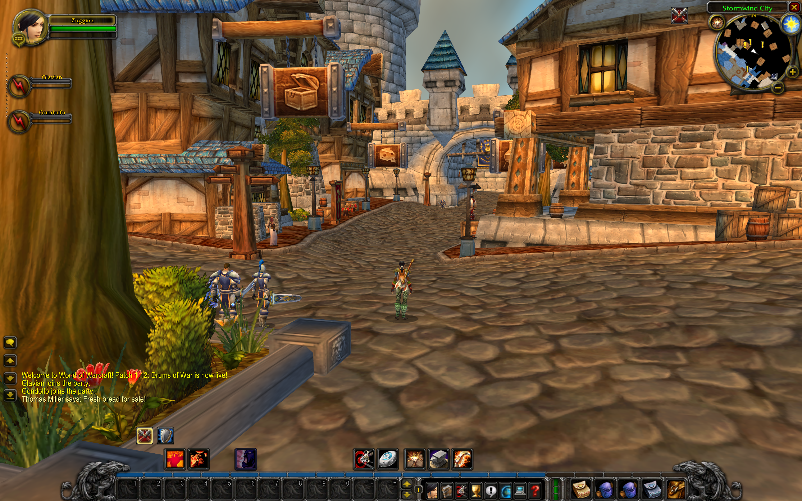

## Why There Are Three Projects Now

This stopped fitting into one application because different parts of the game have to happen in different places.

- [MangosSuperUI](https://github.com/Yafrovon/MangosSuperUI) is where I run the server, edit the world, forge items, create spells, manage bots, inspect data, build patches, and generally decide what I want the world to be.
- [SuperUI-Core](https://github.com/Yafrovon/SuperUI-Core) is my VMaNGOS fork. It handles the things that have to happen inside the running server, including persistent playerbots, custom gameplay hooks, Lootifiers, combat execution, possession, and party control.
- [MSUIClient](https://github.com/Yafrovon/MSUIClient) is the client I actually enter the world through. It supports normal MMO play, but it also gives me room to build the party controls and in-world creation tools I could never add cleanly to the original 1.12 client.

I'm not trying to turn these into three products that happen to share a name. MangosSuperUI is where I shape the world, SuperUI-Core is where that world runs, and MSUIClient is where I play it.

Do you need all three to get any use out of this? No.

- MangosSuperUI can still do a lot with stock VMaNGOS.
- The original 1.12.1 client still works with SuperUI-Core.
- MSUIClient can do basic Vanilla play against a compatible VMaNGOS server.
- The bots, Lootifiers, possession, and party controls use SuperUI-Core.
- Creator Mode and NPC Dev use MangosSuperUI when they hand work back to the web app.

The version I'm building for myself uses all three. That is where the persistent bots, custom game mechanics, in-client tools, and party controls come together.

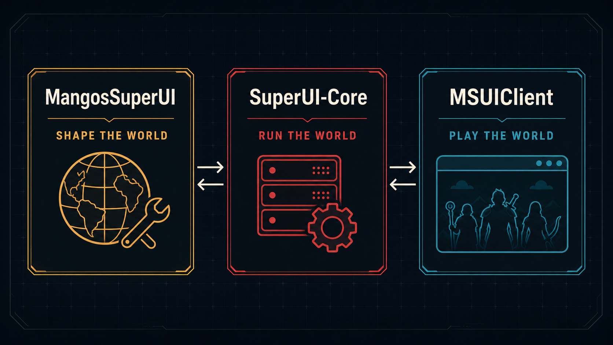

## Why This Exists

I run a 1.12 VMaNGOS emulation server at home - not public, just for me.

We all have our own idea of what Vanilla could have been, or what we wanted it to be. To make that happen for myself, I needed a way to modify and tune the game world in large, repeatable jobs so I could build that version, play it, and later start again with a slightly different take.

My end goal is a living game world with thousands of AI-driven characters that feel real enough, custom spells and items, gameplay additions that feel like they belong in Vanilla, and the tooling to iterate on all of it without mentally retooling myself for every separate subsystem.

I want to be able to change an entire loot system, forge a weapon, move a building, inspect why a bot made a bad decision, change its combat priorities, and then log in and play the result. That is what turned a server-admin UI into this much larger project.

MSUIClient closes the missing part of that loop. I can modify the world, run the world, and now change how I interact with it from inside the game.

I'm open-sourcing it because if I wanted this, other people running VMaNGOS - or people who simply want to explore Vanilla client and server emulation - probably could too. It is first and foremost the tooling and game stack I'm building toward my own vision. It is not a commercial product. Feedback, bug reports, and contributions are welcome.

## MMO First, Party CRPG When I Want It

Most of the time I still want to play normally. I log into one character, run through the world, pick up quests, fight, loot, equip gear, talk to people, and do all the things I would expect from a Vanilla client.

When I am grouped with my bots, I also want the option to pull the camera back and control the party as a group. That means selecting characters, assigning control groups, setting formations, giving movement orders, and using command cards instead of clicking through the party one character at a time.

Box-selecting the party and putting them into formation is an RTS kind of interface. I am borrowing that interface because it makes sense for controlling a party. It is still the CRPG experience inside the same running MMO world.

If I pull the camera back and tell my priest where to stand, I have not left the MMO world or loaded a different game mode. I am still controlling the priest I leveled and geared. She still has her mana, threat, equipment, quests, repair bills, and a corpse to run back to when things go wrong. I have only changed how I am controlling the party.

Right now I can log in and play, possess bots, move into free view, keep the party together, and inspect their bags and character sheets. Selection, control groups, formations, command cards, and the rest of the larger party-control UI are built and largely functional but under active development.

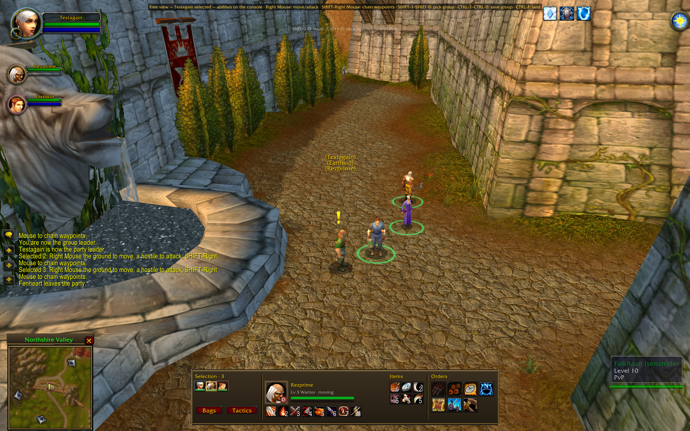

## Where It Is Right Now

This is a large project and nothing here is done by the standard I am aiming for. Some parts I use all the time. Some are a solid first version with plenty left to add. Some exist because I proved the path and have not finished the rest of it yet.

| Area | Where it stands |
| --- | --- |
| Server administration | **Working and in regular use.** The dashboard, console, accounts, configuration, logs, diagnostics, backups, and normal server operations are some of the most complete parts of MangosSuperUI. |
| SuperUI-Core | **Working and under active development.** It runs the bots, Lootifier hooks, combat rotations, possession, and the server side of the party controls. |
| World States and Change Graph | **Working and expanding.** Worlds can be parked, resumed, forked, labeled, and inspected, while the Change Graph records what the different tools changed. |
| Content editing | **Working, with real gaps.** Items, spells, game objects, loot, instance rewards, and baseline resets work. The full vendor, quest, and creature editors are not finished. |
| Weapon Forge and Armor Forge | **Working, but still being expanded.** They can clone Vanilla equipment, import any gear from TBC or WRATH, uvunwrapped & textured .glb weapons from the web, build item data, preview results, and generate client patches. Not every imported asset automatically looks or behaves like it was made for 1.12.1, as not every effect from TBC or WRATH can be rendered in the vanilla client. In those cases, a substitute 1.12 effect is used.|
| Lootifiers | **Working.** ARPG, quest, and crafting variants use the same tier rules, with SuperUI-Core handling the parts that happen when an item is awarded or crafted. |
| Retexture Engine | **Experimental.** Palette-based recoloring and tier variations work. It is not yet the general-purpose, art-directed retexturing system I eventually want. |
| World Map | **Working.** I can browse the world, inspect spawns, resolve terrain height, and place game objects visually. |
| 3D World Editor | **Experimental.** Terrain viewing, sculpting, WMO placement, patch generation, and rebuild paths exist. The complete edit-to-play loop still has gaps. |
| Spell authoring | **Working, but limited.** I can build spells from understood source spells, change visuals, build rank chains, register trainers, and generate patches. Making a truly new spell family from nothing is still much harder than I want it to be. |
| AI playerbots | **Working, but far from finished.** They level, quest, fight, travel, group, use real character state, and run dynamic combat rotations. Long-term autonomy and serious raid behavior still need a lot of work. |
| Bot Cockpit and Circuit Board | **In development.** The administration, inspection, maps, roles, loadouts, execution tracing, and debugging tools exist and are continuing to grow with the bot system. |
| MSUIClient normal play | **Playable and under heavy development.** I can log in, enter the world, move, fight, quest, loot, equip gear, and use the normal game interfaces. There are still visual and gameplay bugs to find. |
| MSUIClient party play | **Early, but real.** Possession, free view, party following, bot bags, and character sheets work. The larger RTS-style control set is the part I am building now. |
| MSUIClient Creator and NPC tools | **In development.** Creator Mode can send spell work into MangosSuperUI, and NPC Dev can submit spatial edits from inside the client. Both workflows are still being expanded. |
| Database Explorer and documentation | **Working and expanding.** Database relationships, source indexing, generated Core documentation, and Vanilla Lua and UI references are available. |
| Profession Tuning | **Early.** Reagent-cost tuning and rollback work. Building completely new profession content is still future work. |

## MangosSuperUI - Operate and Author the World

MangosSuperUI is the web application in this repository. It started as an administration layer, but it is now also the main authoring and inspection surface for the rest of the stack.

### Server Operations

**Dashboard** - World and authentication server health, RA connectivity, database status, players, uptime, revision information, CPU and memory use, per-core information, setup warnings, and targeted diagnostics.

**Console** - A full RA terminal in the browser with live responses, command history, and autocomplete.

**Players, Accounts, and Realm** - Search and inspect characters and accounts, perform administrative actions, edit realm configuration, and keep those changes visible in the audit trail.

**Configuration** - The large mangosd configuration surface is organized into human-readable groups with descriptions and inline editing instead of requiring every change to happen in a long configuration file.

**Logs** - Live log streaming plus browsable character, chat, economy, transaction, Warden, spam, behavior, and battleground records.

**Diagnostics** - The Dashboard can test the systems around the server instead of only reporting that something failed. Recent work also exposes resource use and file-limit conditions that can place a hard ceiling on a large bot population.

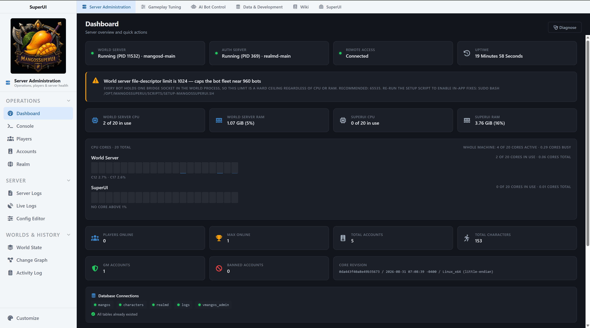

### World States, Backups, and Change History

The normal backup system handles the game databases, characters, and Core source with labels, validation, and safety snapshots.

World States let me park one version of the world, fork it, try something completely different, and come back later. I can label snapshots, inspect the lineage, and choose which world I want to run. Once one is running, it behaves like any other VMaNGOS world.

The **Change Graph** separates current drift from complete history. It can group changes by domain, batch, and entry, show field-level differences, drill into what a tool changed, and undo supported entries or batches.

It is the difference between knowing that I changed 400 items and knowing why those 400 items changed together.

### Content Editing

**Items** - Browse and search the world item database, inspect stats and sources, edit or clone items, reset against the original baseline, stage retextures, and preview equipment and held models on a 3D character.

**Spells** - Search and edit server spell templates with DBC-resolved metadata, families, icons, durations, cast times, and ranges.

**Game Objects** - Browse, clone, edit, delete, preview, and place game objects through the World Map and related tools.

**Loot Tuner** - Adjust loot rates in batches by quality, level, rank, instance, or other filters, compare the result against the baseline, and reset it.

**Instance Loot** - Inspect real boss and reference-loot chains, edit drop chances, and add or remove rewards at the encounter level.

The full web editors for vendors, quests, and creature templates are not finished. MSUIClient can play through those systems, and NPC Dev can edit creature placement and movement, but that is not the full browser editor I want.

### Weapon Forge and Armor Forge

Weapon Forge and Armor Forge are now major compliments to the Items page.

Weapon Forge can build Vanilla-compatible weapons from cloned Vanilla assets, all TBC and Wrath assets, or imported GLB models. It handles the model, textures, display information, placement, recoloring, effects, item fields, preview, registry, and generated client patch as one workflow.

Armor Forge applies the same idea to armor pieces and sets. It can import compatible expansion pieces, clone Vanilla equipment, import TBC and Wrath assets, build full sets, define itemization and set bonuses, create recolors during import and also recolor effects, and register the result for patch generation. 

Recolors of the assets & the spell effects (animations etc.) are all live preview in the MSUI web app as see below in the screenshot. You can tune intensity, colors, and you preview this realtime.

The item builder exposes the real Vanilla fields instead of translating everything into a simplified modern stat system. Flat stats remain flat. Spell and equip effects keep their trigger, charges, cooldowns, categories, and other native behavior.

Can it import an asset and make it work in Vanilla? Yes. Does every imported weapon or armor set automatically look like Blizzard built it for 1.12? No. Asset choice, placement, effects, texture work, and item design still matter.

Forged weapons, forged armor, and retextures are all under patch-4.MPQ.

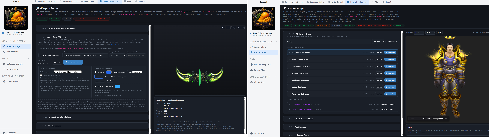

### Lootifiers

The Lootifiers are additive item-variant systems. They preserve the base item and roll new versions on top of it through shared stat budgets, tier bands, naming rules, quality floors, and rollback data.

- **ARPG Lootifier** - Builds dungeon, raid, and open-world item variants with named tiers, stat families, quality promotion, boss-named results, and additive drop pools.
- **Quest Lootifier** - Selects generated quest-reward variants at award time through a SuperUI-Core hook instead of replacing the original quest table.
- **Crafting Lootifier** - Selects generated crafted variants when the item is created. It discovers gear-producing recipes from client data and can tune them by profession.

The goal is not to erase Vanilla itemization. It is to keep the original item recognizable while making later playthroughs and repeated content less solved.

### Retexture Engine

The Retexture Engine creates tier-based palette variants for equipment. It can keep sets visually coherent, apply different color theories, invert or preserve value ranges, preview results on a 3D character, and feed the chosen textures into the unified item patch.

At the moment, it is a palette and value transformation system. It is useful, but it is not yet the general tool where I can ask for a completely new hand-painted texture and reliably get one that belongs in the game world.

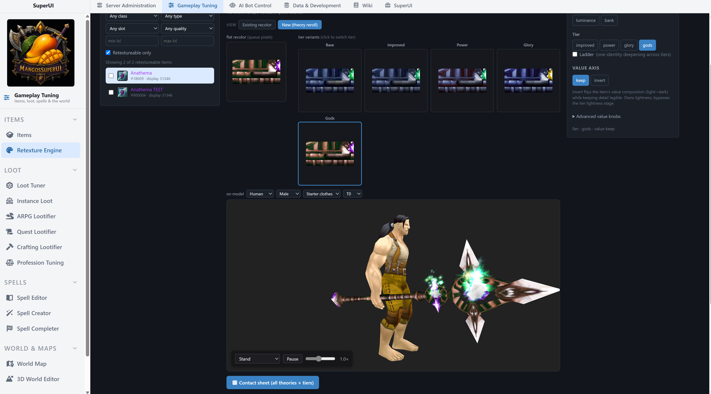

### Spell Creator and Spell Completer

There are now two spell-authoring paths.

The original **browser Spell Creator** provides a guided wizard, workshop controls, experiments, previews, icon generation, rank chains, trainer registration, and patch output.

**MSUIClient Creator Mode** starts the other route inside the client, where I can see and hear the spell while I work on it. When I am happy with the result, it sends the session to **Spell Completer** in MangosSuperUI.

Spell Completer builds the spell rows, spellbook classification, rank chains, trainer wrappers, custom sounds, and patch content.

Can it take a known spell, recolor it, alter its emitters, give it a new identity, build ranks, add a trainer path, and make it playable? Yes. Can it create every genuinely novel spell effect from nothing while explaining every unknown M2 phase and client rule? No. It is a good start to the spellmaking system, but it still has a lot to go.

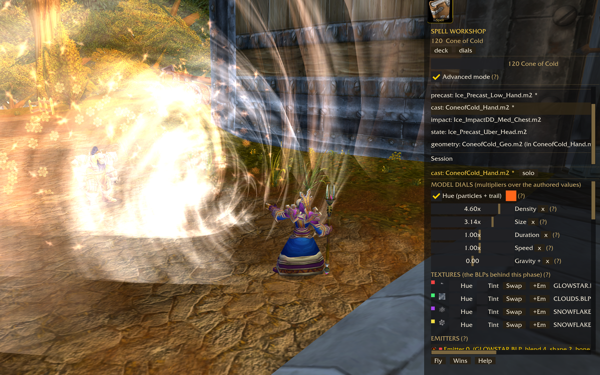

### World Map and 3D World Editor

The **World Map** uses the client minimaps for continents, dungeons, and raids. It can display spawns, resolve terrain height from server map data, and place game objects with position and orientation controls.

The **3D World Editor** reads terrain and world assets from the user's client data and renders ADT terrain, textures, M2 doodads, and WMO buildings in the browser. It includes walk mode, spatial streaming, object placement, and terrain-editing paths that can generate the corresponding client and server artifacts.

I can place a WMO, build the patch, and see it in the game world. Interiors, caves, collision, and some vmap, mmap, and custom-display cases are still rough.

This will likely be deprecated in the future as I migrate this workflow into the client's creator mode where it's more natural.

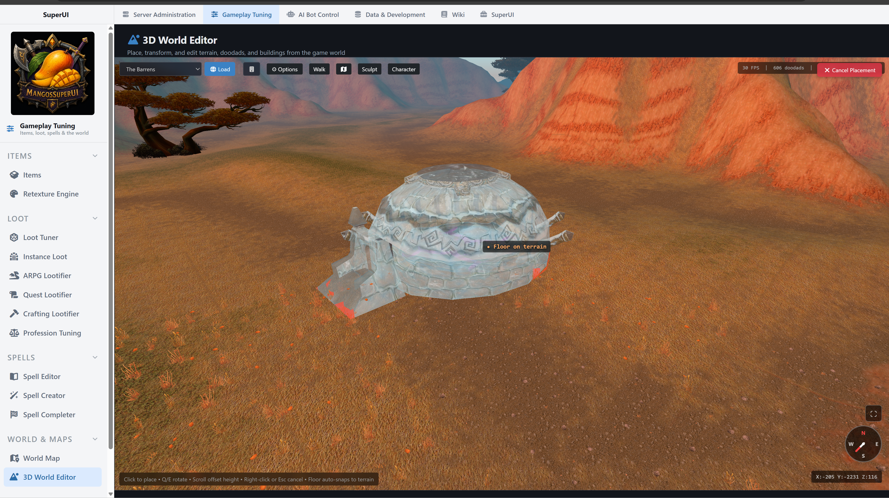

### NPC Development

The full browser creature catalog and template editor is still planned.

NPC Development turns the live world into the editor. I can click the NPC standing in front of me, move or rotate it, change its respawn and movement settings, build waypoints or creature groups, then send the result to MangosSuperUI to save and audit.

Moving an NPC and reloading it in the world works now. Baseline comparison and reset are the next parts I need to finish.

### Profession Tuning

Profession Tuning can preview and apply non-compounding reagent reductions across a profession, opt individual recipes out, show what has already been tuned, restore one recipe, or roll the entire batch back.

The larger goal of adding completely new items into profession progression, trainer lists, and drop paths is still planned.

### Data, Source, and Documentation

**Database Explorer** treats the VMaNGOS schema as a connected graph rather than a pile of unrelated tables. It includes relationship navigation, inline editing, audit history, and interactive ER views built from validated relationships.

**OG Baselines** preserve the original values used for field-level comparisons and targeted resets.

**Source Map** indexes the C++ tree by files, symbols, types, enums, and calls. It provides source previews, call graphs, and context bundles for understanding where a mechanic actually lives.

**Wiki** contains generated SuperUI-Core documentation grounded in deterministic source analysis. The model writes the prose after the structural facts are mined and validated. It does not invent the map.

The Wiki also includes Vanilla Lua and UI references built from harvested FrameXML templates, frames, textures, functions, and globals.

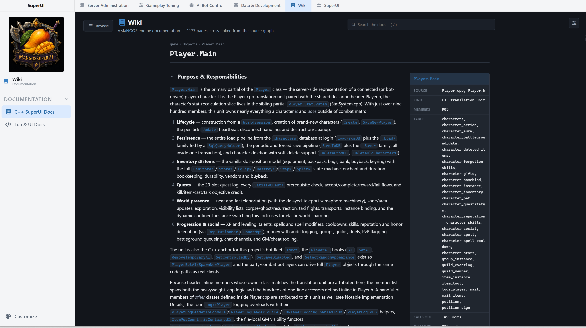

### Included Addons

MangosSuperUI also builds or hosts optional addons for the original 1.12.1 client:

- **MSUI Loot Browser** - Generates an in-game loot browser from the live server data, including dungeon, raid, crafting, and generated variant information.
- **MSUI Dual Spec** - Adds two in-place talent and action-bar snapshots with switching rules designed for Vanilla.
- **MangosSuperUI Placer** - Provides an in-game catalog and controls for spawning, selecting, moving, rotating, and deleting supported custom objects.

These addons are separate from MSUIClient. MSUIClient can implement client functionality directly, while the addons remain useful for players using the original client.

## SuperUI-Core - Run and Persist the World

SuperUI-Core is a customized VMaNGOS fork. VMaNGOS remains the foundation: its world simulation, networking, databases, scripts, progression model, and years of emulator work are underneath everything here.

SuperUI-Core is the C++ half of the project. It carries the things that have to happen immediately inside the running server:

- Persistent playerbots with real characters, inventories, equipment, spells, gold, quests, groups, and progression.
- Movement, combat, interaction, travel, and party commands.
- The TCP bridge that lets the C# bot brain assign work and inspect what happened.
- Per-bot combat rotations, with the original VMaNGOS behavior still available as a fallback.
- Quest and crafting reward hooks for the Lootifiers.
- The extra messages MSUIClient uses for possession, party facts, and party control.

The original 1.12.1 client can still connect because those extra messages are only sent to MSUIClient.

This is the server I use for the full SuperUI stack. It works, it moves quickly, and it is not finished.

## AI Playerbots - Barrens Chat

The bot system is probably the largest subsystem across the three repositories.

These are persistent in-world characters, not external automation clients and not temporary dungeon companions. They use the real character tables, real equipment, real gold, real spells, real quest status, and real group state.

A bot uses all three projects:

- **SuperUI-Core** moves it, fights, interacts with the world, travels, and executes the immediate party commands.
- **MangosSuperUI** decides what it should quest for, when it should repair or train, who it should group with, what it should say, and which combat rotation it should use.
- **MSUIClient** is where I can take one over, pull back into free view, or control the party.

### What the Bots Do Today

- Quest through a real quest graph with objective and sub-phase tracking.
- Grind, fight, die, corpse-run, loot, repair, train, travel, and vendor.
- Join groups, follow real players, and operate through party and escort rules.
- Load per-bot role, specialization, talent, spellbook, and rotation information.
- Use real inventory and economy state rather than a shadow copy.
- Talk through optional local LLM support with personas, voice rules, memory, urge scoring, typing delays, and editable chat settings.

They work, but they are still far from the final goal. They level and quest. You can group with them. They can follow a real player into content. They still die too much, make bad long-horizon decisions, and often behave more like henchmen than convincing independent players. Full dungeon and raid autonomy is not solved.

### Bot Cockpit, Fleet View, and Map

The Bot Cockpit can batch-spawn bots, inspect their live state, control grouping, reload or reconnect them, manage roles and loadouts, view talents and spellbooks, inspect quests and inventory, and issue per-bot or population-wide administrative commands.

Fleet View correlates failures and activity across the population instead of forcing every diagnosis to start with one bot.

The Bot Map shows live positions, trails, incidents, failure hotspots, and context exports across the world.

Chat Feel and Chat Capacity separate the personality and presentation controls from the practical limits of the local language-model service.

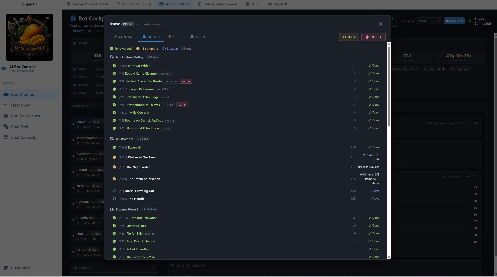

### Circuit Board

Circuit Board traces a bot decision from human-scale activity back into the logic that produced it.

It includes a live circuit schematic, activity episodes, raw events, exact C# and C++ source around instrumented probes, arm and disarm controls, shadow tracing, forced dumps, and exportable Markdown packets for debugging.

This replaced older tracing paths that produced data without making the decision chain understandable. The point is not another dashboard. The point is being able to answer: What did this bot think it was doing, which layer changed that intent, what reached the Core, and where did the result stop matching the plan?

## MSUIClient - Play and Control Your Party

MSUIClient is a separate playable client. It isn't an addon, a reskin of the original client, or a browser viewer.

It is written in C# on .NET and Silk.NET/OpenGL. It reads the user's own WoW data directly from MPQ archives, parses the Vanilla client formats it needs, and speaks the genuine 1.12.1 network protocol.

The normal client loop includes:

- Login and character selection.
- A streamed 3D world with ADT terrain, WMO buildings, M2 models, characters, creatures, equipment, water, foliage, lighting, particles, and collision.
- Movement, camera control, targeting, combat, spell casting, action bars, inventory, equipment, loot, quests, vendors, chat, groups, maps, audio, and normal interface panels.
- Normal VMaNGOS support for normal Vanilla play.
- Extra possession, Creator, and party controls when connected to SuperUI-Core.

MSUIClient is playable, but it is not finished. Animation, rendering, UI, audio, collision, and edge cases all still need work. I would call it a mid alpha, with plenty left to do.

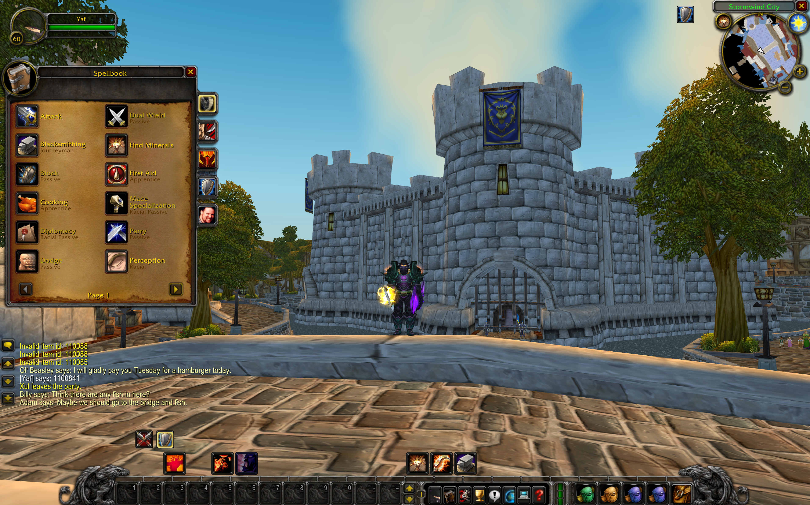

### Creator Mode

Creator Mode starts a spell inside the client, where I can see the effect, hear it, change it, and test it in the actual world. When I am happy with it, the client sends the session to Spell Completer in MangosSuperUI to build the database rows, ranks, trainer entries, sounds, and patch.

### NPC Development

NPC Dev lets me click the NPC standing in front of me, move or rotate it, change its movement and respawn settings, build waypoints or creature groups, and send the result to MangosSuperUI to save and audit.

### Playing the Whole Party

I can possess one of my bots, move it directly, pull back into free view, keep the party following, and inspect each character's bags and character sheet.

Selection, control groups, formations, command cards, party-wide inventory, and quest actions are the next part of that same party UI. The complete control surface is still being built.

### Encounter Lab

Encounter Lab is my attempt to plan dungeon and raid fights from inside the actual world.

I can select the groups, click where I want them to stand, assign targets and movement, connect the plan to combat rotations, and save it for another pull.

The editor and early simulator exist, but Core does not execute the full plan yet. This is not something I can raid with today.

## How the Pieces Connect

Basic server administration and normal Vanilla play can be used separately. The bots, client Creator tools, NPC Dev, possession, and party controls are where the projects start working together.

- MangosSuperUI talks to SuperUI-Core through RA, the databases and configuration, generated content, and the bot bridge.
- MSUIClient logs in through the normal 1.12.1 protocol. SuperUI-Core adds the messages used for possession and party control.
- Creator Mode, Spell Completer, NPC Dev, and Encounter Lab pass work directly between MSUIClient and MangosSuperUI.
- Generated patches carry custom items, spells, models, textures, sounds, and DBC data into the client.

## Requirements

### MangosSuperUI

- A working VMaNGOS or SuperUI-Core server with populated databases.
- Ubuntu 22.04 or a similar Linux environment for the currently tested web deployment.
- .NET 8 runtime, or the SDK when building from source.
- MariaDB or MySQL compatible with the selected VMaNGOS revision.
- Access to user-owned compatible WoW client data for asset-backed authoring features.
- Compatible user-provided TBC or Wrath client data only when using those specific Forge import lanes.

Optional advanced integrations:

- Ollama for bot chat and supported prompt workflows.
- ComfyUI for supported image and texture generation paths.

### SuperUI-Core

- The build requirements and database prerequisites documented by the [SuperUI-Core repository](https://github.com/Yafrovon/SuperUI-Core).
- The database and script updates that go with the Core release.
- The MSUIClient release paired with that Core release when using possession and party controls.

### MSUIClient

- Windows 10 or Windows 11. Linux and mobile are not supported release targets yet.
- .NET 8 runtime, or the SDK when building from source.
- User-owned WoW 1.12.1 build 5875 client data.
- A compatible VMaNGOS or SuperUI-Core realm.

## Installation

Each repository keeps its own setup guide:

- [MangosSuperUI installation guide](INSTALL.md)
- [SuperUI-Core installation guide](https://github.com/Yafrovon/SuperUI-Core/blob/development/INSTALL.md)
- [MSUIClient repository](https://github.com/Yafrovon/MSUIClient)

<!-- RELEASE TODO
Replace the MSUIClient repository link above with its finished release-facing README and setup guide once those files are finalized.
Confirm and document the exact matched release set for MSUIClient and SuperUI-Core.
-->

For the full stack, set up SuperUI-Core, point MangosSuperUI at that world, prepare the client data, then use the MSUIClient release paired with that Core release. It is not a one-click setup yet, so the details stay in the three setup guides.

## Game Assets and Disclaimer

This project is not affiliated with or endorsed by Blizzard Entertainment.

World of Warcraft is a registered trademark of Blizzard Entertainment, Inc.

The repositories do not distribute Blizzard game assets. Users supply their own compatible client data.

MSUIClient reads the user's own 1.12.1 MPQs directly. MangosSuperUI can read the same user-provided data and create local caches, previews, converted assets, or generated patches for its tools.

Some MangosSuperUI features still need prepared DBCs, maps, vmaps, mmaps, M2 files, or browser-ready assets. [INSTALL.md](INSTALL.md) lists what each feature needs.

Contributors must not submit proprietary client assets, private server data, credentials, generated local caches containing protected material, or other files they do not have permission to distribute.

MangosSuperUI is intended for educational, research, archival, interoperability, and private emulator-development use.

## Technology

| Project | Main technologies |
| --- | --- |
| **MangosSuperUI** | ASP.NET Core 8 MVC, C#, Razor, JavaScript, SignalR, Dapper, MariaDB/MySQL, Three.js, Leaflet, managed game-data tooling, and conditionally packaged StormLib binaries for legacy paths. |
| **SuperUI-Core** | C++, CMake, VMaNGOS, MariaDB/MySQL, and the SuperUI server modules and protocol. |
| **MSUIClient** | .NET 8, C#, Silk.NET, OpenGL, ImGui, direct MPQ and Vanilla-format readers, and the 1.12.1 network protocol. |

## Repository Map

These are separate repositories, not folders in one solution:

~~~text
MangosSuperUI/
  MangosSuperUI/             ASP.NET web application
  MangosSuperUI.Tests/       focused application and system tests
  docs/                      engineering and feature documentation
  docs_full/                 generated Core documentation
  Screenshots/               README and documentation images

SuperUI-Core/
  src/game/SuperUiContent/
    SuiBots/                 persistent bot execution and related Core systems
  sql/                       database and migration requirements
  docs/                      protocol and Core documentation

MSUIClient/
  MSUIClient/
    Engine/                  platform, rendering, UI, and shared runtime systems
    Formats/                 Vanilla client-format readers
    GameLoop/                gameplay, HUD, panels, combat, and scene control
    Net/                     login, world protocol, and SuperUI capabilities
    World/                   streamed world and entity rendering
  docs/                      current systems, plans, and implementation records
  tools/                     focused verification and diagnostic tools
~~~

## Roadmap

### Being Finished Now

- Finish the public MSUIClient documentation, setup, license, and release package.
- Tag the MSUIClient and SuperUI-Core releases that work together.
- Keep playing through quests, vendors, inventory, groups, combat, audio, animation, and instances, and fix what breaks.
- Polish Weapon Forge, Armor Forge, and the unified item patch.
- Polish the Spell Creator and Spell Completer workflow.
- Keep improving bot progression, grouping, economy, and long-horizon behavior.
- Replace the old screenshots and finish the documentation across all three repositories.
- Continue the painterly renderer work.

### Experimental Systems

- Expand the party-wide facts and tactical commands.
- Finish party inventory transfer, formations, roles, and tactics.
- Connect Encounter Lab plans to Core in the normal MMO world.
- Finish the later NPC Dev phases.
- Expand Creator Mode beyond the current spell workflow.

### Longer-Term Direction

- Complete Encounter Lab raid-plan authoring and execution.
- Full web editors for creature templates, vendors, and quests.
- Adding completely new items into profession progression.

## Contributing

See [CONTRIBUTING.md](CONTRIBUTING.md) for the MangosSuperUI contribution guide.

Open an issue before beginning a large change.

For a cross-project bug, include the three versions you were running and the exact workflow that failed. Circuit Board exports are especially useful for bot bugs.

Never include Blizzard client assets, credentials, personal database snapshots, or generated private-server state in a contribution.

## Acknowledgments

MangosSuperUI and the larger SuperUI stack are co-developed with AI tools, especially Claude and Codex. I am a systems engineer and software developer by trade, but there is no chance I could have built this much this quickly without that help.

None of this would exist without the years of work by the VMaNGOS team and the broader MaNGOS lineage. The same is true of the modding and emulation communities that documented DBC files, MPQ and BLP formats, M2 and WMO structures, spell effects, loot systems, client packets, UI behavior, and the hundreds of strange rules that make Vanilla work.

I am connecting that work into one place for a very particular 1.12 experience. The foundation belongs to the people who spent years making it possible to understand.

## License

MangosSuperUI is licensed under the [GNU General Public License v2.0](LICENSE).

Third-party library licenses for this repository are documented in [THIRD_PARTY_NOTICES.md](THIRD_PARTY_NOTICES.md).

SuperUI-Core retains the licensing requirements of its VMaNGOS foundation. See the [SuperUI-Core license](https://github.com/Yafrovon/SuperUI-Core/blob/development/LICENSE).

<!-- RELEASE TODO
Add the final MSUIClient license name and link here before publishing this README.
-->
